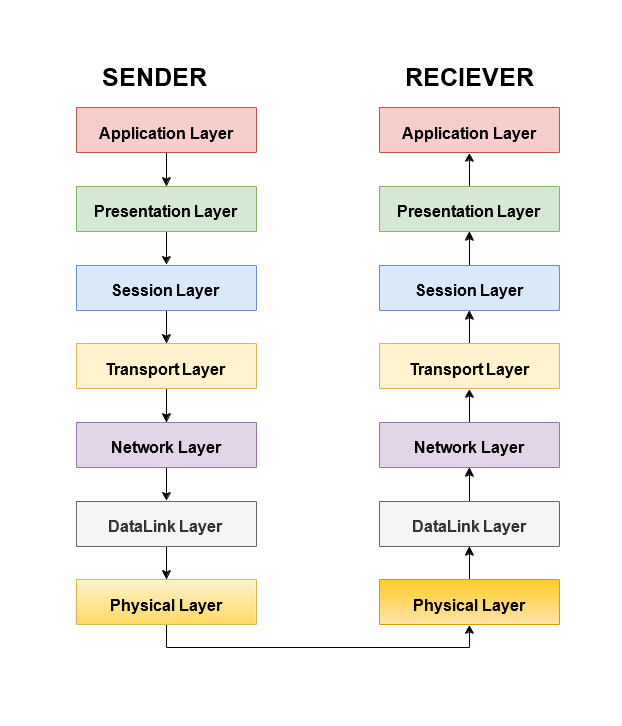
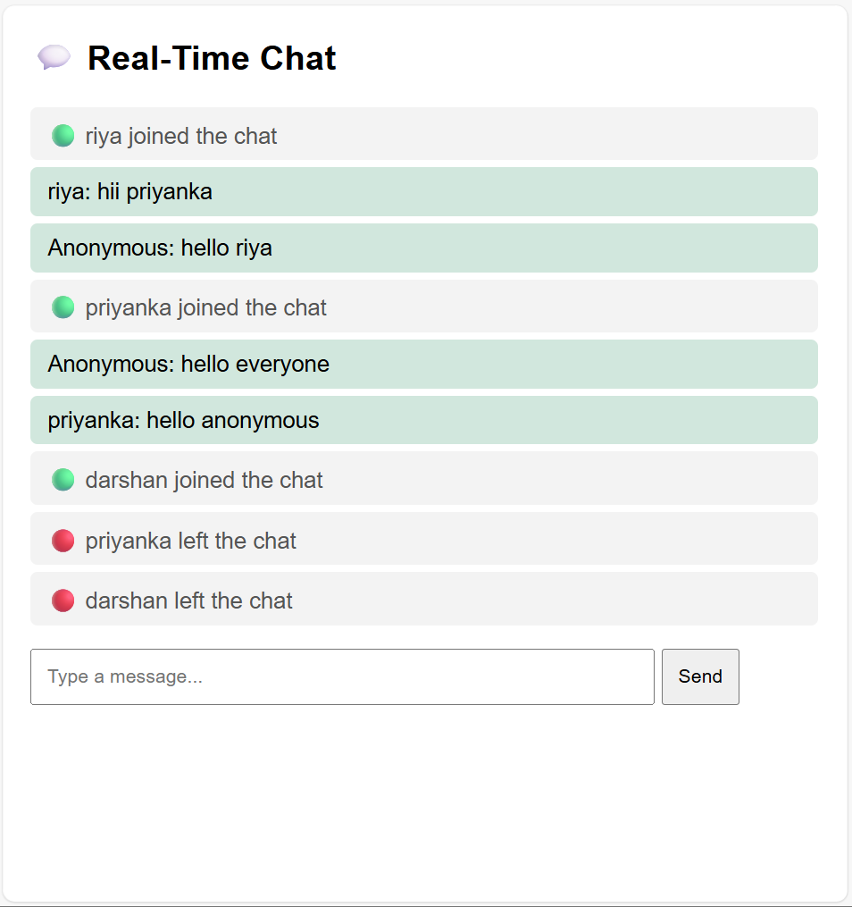
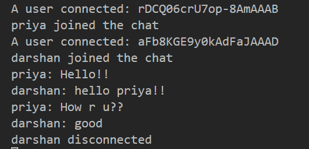

# Marvel Level 1 Tasks
## OSI Model
#### The Open Systems Interconnection (OSI) model describes seven layers that computer systems use to communicate over a network.
#### The Seven Layers are:
### 1.Application Layer:User interface for network service
#### Example:Email application,Whatsapp
#### Protocols:HTTP/HTTPS-web
####           SMTP-email
####           FTP-File Transfer
####           DNS-Domain Name Resolution
### 2.Presentation Layer:
####                     >Encrytion-Encryted data=cipher data
####                      >Decription-Decryted data=Plain data
####                      >Translation-->Ex:ASCII to EBCDIC,JPEG,JSON,MP4
####                      >Compression-Size of data is reduced
####                      >Formatting data
### 3.Session layer:>Session establishment,maintanence,termination is done
####                 >Communication between sender and reciever
####                 >Session starts
### 4.Transport layer:>End to End communication between devices
####                   >Ensure reliabile delivery sequencing(Add destination & start port no.)
####                   >Uses TCP,UDP
####                   >Data is converted into "segments"
####                   >Uses handshaking for reliable connection
### 5.Network layer: >Segments are turned into "packets"
####                  >IP addressing is done here
####                  >Finds best route(uses routing and switches)
####                  >Devices used are Routers and Layer 3 Switches
### 6.DataLink layer:Encapsulated into "frames"
####                 >Sublayers: MAC and LLC
####                 >MAC addressing occurs here
####                 >Functions are:> Error free controlling
####                               >Flow control maintain speed
####                               >Physical addressing
### 7.Physical layer:Data converted into bits
####                  >Deals with actual physical connection
####                  >Bit transmission-Transmits raw bits(0's and 1's)
####                  >Bit synchronization
####                  >Specifies which topologies used(Bus/star/mesh)

# TASK 2:SOCKET.IO
### Socket.IO allows bi-directional communication between client and server. Bi-directional communications are enabled when a client has Socket.IO in the browser, and a server has also integrated the Socket.IO package. While data can be sent in a number of forms, JSON is the simplest.

# TASK 3:IaaS,SaaS,PaaS
### What is Cloud Computing?
#### Cloud computing means using someone else’s computer (on the internet) to store data, run programs, or host services, instead of using your own local computer or server.It’s like:
#### Instead of buying and maintaining your own computer servers, you rent them on demand from companies like AWS (Amazon Web Services), Google Cloud, or Microsoft Azure.
### Example You Already Use:
#### When you upload photos to Google Drive, you’re using cloud storage.
#### When you watch Netflix, the videos come from cloud servers.
#### When a startup hosts its website on AWS, it’s using cloud infrastructure.
### 3 Main Types of Cloud Computing Services
#### These are called service models — and they describe how much control you have over the system.
### 1. IaaS — Infrastructure as a Service
#### Think: Renting virtual machines and networks instead of buying physical hardware.
#### >What you get:
#### *Virtual servers (computers)
#### *Storage
#### *Networking
#### > You manage: The software, operating system, applications, etc.
#### > Provider manages: The physical servers, networking, and data centers.
#### >Example:
#### *AWS EC2 (Elastic Compute Cloud)
#### *Microsoft Azure Virtual Machines
#### *Google Compute Engine
#### >Use Case:
#### Startups or developers who want full control over their servers but don’t want to buy expensive hardware.
#### >Simple Example:
#### It’s like renting a blank apartment — you decorate, install things, and make it your own.

### 2. PaaS — Platform as a Service
#### Think: You just code — the cloud handles setup, OS, and runtime.
#### >What you get:
#### *Development framework
#### *Operating system
#### *Databases
#### *Web servers and runtime environments
#### >You manage: Only your application and data.
#### >Provider manages: Infrastructure, OS, networking, and runtime.
### >Example:
#### *Google App Engine
#### *AWS Elastic Beanstalk
#### *Microsoft Azure App Services
#### >Use Case:
#### Developers who want to focus on building apps, not managing servers.
#### >Simple Example:
#### It’s like renting a fully-furnished apartment — you just move in and live. Everything else (maintenance, furniture) is handled.

### 3. SaaS — Software as a Service
#### Think: Ready-to-use software on the internet.
#### >What you get:
#### Complete applications hosted online
#### You only need a browser or app to access it
#### >You manage: Nothing! Just use it.
#### >Provider manages: Everything — app, data, security, servers, updates.
#### Example:
#### *Gmail
#### *Google Drive
#### *Zoom
#### >Use Case:
#### End users who just want to use software without worrying about installation or updates.
#### >Simple Example:
#### It’s like staying in a hotel — everything’s ready for you. You just check in and use it.

## TASK 4:Encryption Techniques - Secure Messaging App

## Definition of Data Encryption
### Data encryption is the process of converting readable information (plaintext) into an unreadable format (ciphertext) using cryptographic algorithms and keys to protect data from unauthorized access. Only authorized users with the correct decryption key can convert the encrypted data back into its original form. Encryption ensures data confidentiality, privacy, and security in digital communication and storage systems.
## Types of Data Encryption and Basic Explanation
### 1. Encryption at Rest
### Encryption at rest protects data that is stored in databases, files, hard drives, or cloud storage. Even if storage media is stolen or accessed without permission, the encrypted data remains unreadable.
**Example:** Encrypted files stored in cloud storage or databases.
## 2. Encryption in Transit
### Encryption in transit protects data while it is being transmitted over networks such as the internet. It prevents attackers from reading or modifying data during transmission.
**Example:** HTTPS encryption used in websites.
## 3. Encryption in Use
### Encryption in use protects data while it is actively being processed in memory. This type of encryption is used in advanced secure computing environments.
## 4. Symmetric Encryption
### Symmetric encryption uses a single secret key for both encryption and decryption. The same key must be securely shared between the sender and receiver.
**Basic Knowledge:**
### * Fast and efficient
### * Used for large data encryption
### * Key sharing is a challenge
**Example:** AES (Advanced Encryption Standard)
## 5. Asymmetric Encryption
### Asymmetric encryption uses two keys: a public key for encryption and a private key for decryption. The public key can be shared openly, while the private key is kept secret.
**Basic Knowledge:**
### * More secure key exchange
### * Slower than symmetric encryption
### * Used for secure communication and authentication
**Example:** RSA
## 6. Encryption Algorithms
### Encryption algorithms are mathematical methods used to encrypt and decrypt data. They define how encryption is performed.
**Examples:** AES, RSA, DES
## 7. Key Management
### Key management involves generating, storing, rotating, and protecting encryption keys. Secure key management is essential to maintain encryption security.
## 8. Hashing
### Hashing converts data into a fixed-length value using a one-way function. The original data cannot be recovered from the hash.
### * Used for password storage and data integrity
### * Not used for data encryption
**Example:** SHA-256
## 9. Digital Signatures
### Digital signatures use encryption and hashing to verify the authenticity and integrity of data. They confirm that data has not been altered and identify the sender.
## 10. Access Control and Authentication
### These mechanisms ensure that only authorized users can access encrypted data using proper credentials and permissions.

## 5.Task 5:AWS CloudFront - Serve content from multiple S3 buckets

#### Steps to set up dynamic content distribution for amazon s3
##### Create an S3 bucket to store your application or website data.
##### Upload dynamic content files to the S3 bucket and keep public access disabled.
##### Open Amazon CloudFront and create a new web distribution.
##### Select the S3 bucket as the origin and enable Origin Access Control (OAC).
##### Redirect HTTP traffic to HTTPS for secure communication.
##### Allow all HTTP methods (GET, HEAD, POST, PUT, DELETE) for dynamic operations.
##### Disable caching by using Managed-CachingDisabled or setting TTL to zero.
##### Enable forwarding of query strings, cookies, and required headers.
##### Create the CloudFront distribution and wait until it is deployed.
##### Use the CloudFront domain name to access dynamic content securely and quickly.

## 6.Create an application on EC2 instance

##### Amazon Elastic Compute Cloud (Amazon EC2) is a web service that provides secure, resizable compute capacity in the cloud. Amazon EC2 offers many options that help you build and run virtually any application. 

## 7.Database task - DynamoDB

